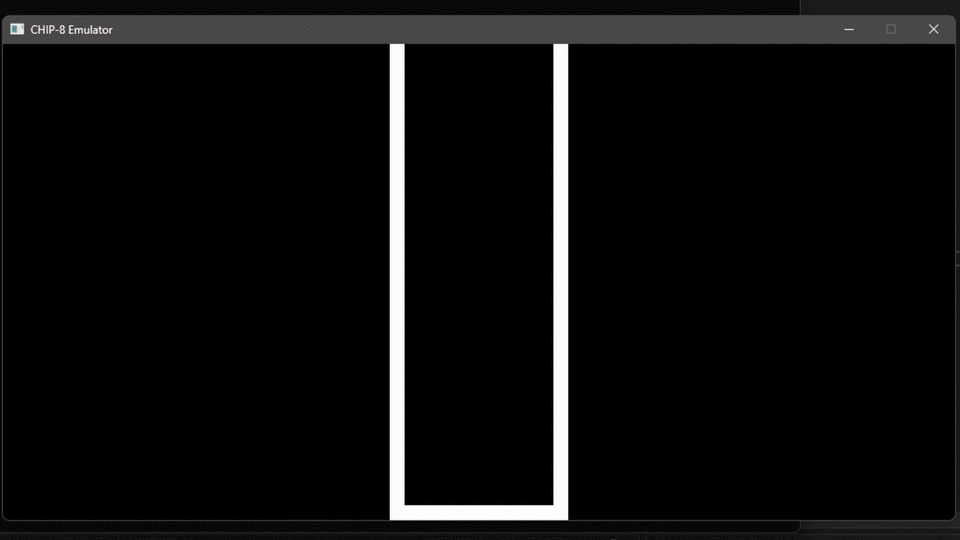

# CHIP-8 Emulator
A C++ version of the [CHIP-8 Interpreter](https://en.wikipedia.org/wiki/CHIP-8). 
For this implementation I've consulted the [Cowgods's CHIP-8 Technical Reference](http://devernay.free.fr/hacks/chip8/C8TECH10.HTM#00E0), but might be slightly different for some opcodes. Roms that you can find in the internet aren't written in the same way due the multiple extensions developed in the years. 
To manage the graphics I've used the [SDL2](https://www.libsdl.org/) Library.
## Screenshots

